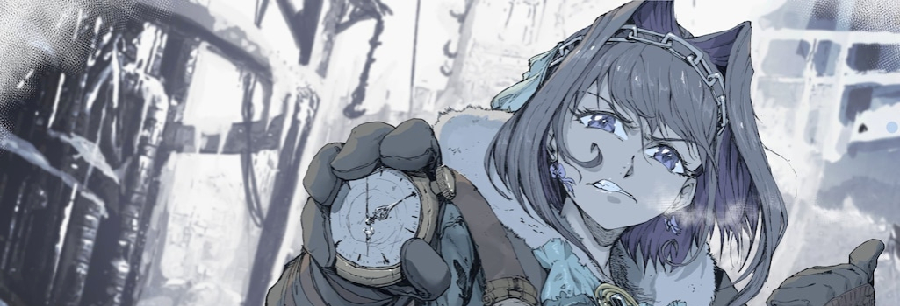

<h1>Hi there 👋 </h1>

- 🔭 I’m currently working on discord-bot and szh2.0
- 🌱 I’m currently learning React
- 📫 How to reach me: <a href="https://discord.gg/A4x6ZqUtZf" target="_blank">Discord Server</a> or H4cK3Rm4N#5813 in discord
<!-- - 😄 Pronouns: He/Him -->
<!-- - 👯 I’m looking to collaborate on ... -->
<!-- - 🤔 I’m looking for help with ... -->
<!-- - 💬 Ask me about ... -->
<!-- - ⚡ Fun fact: ... -->

### 🧰 Languages and other:

<h1>✨The last project I worked with: </h1>

<!-- 🎊 Top languages: -->

<!--  -->
### 🎊 Stats:

<!--
**MaxPopsuy/MaxPopsuy** is a ✨ _special_ ✨ repository because its `README.md` (this file) appears on your GitHub profile.

Here are some ideas to get you started:

-->
