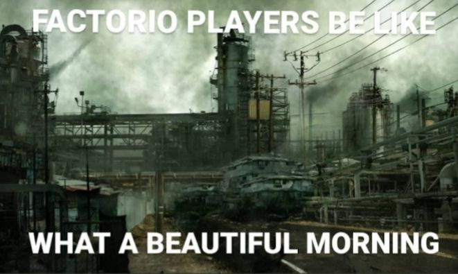

 <!--  -->

<h1>Hi there 👋 </h1>

- 🔭 I’m currently working on simplechat.io
- 🌱 I’m currently learning Vue and Nest.js :)
- 📫 How to reach me: maxim09p@gmail.com or H4cK3Rm4N#0939 in discord;

<h1> 🧰 My skills: </h1>

<!--  -->

<h1> 🧰 Repositories: </h1>

<!--  -->
<!--  -->
<!--  
-->
<!--  -->

<h1> 🎊 Stats: </h1>

<h1> 🎊 Top languages: </h1>

P.S. Thanks Dima :)
